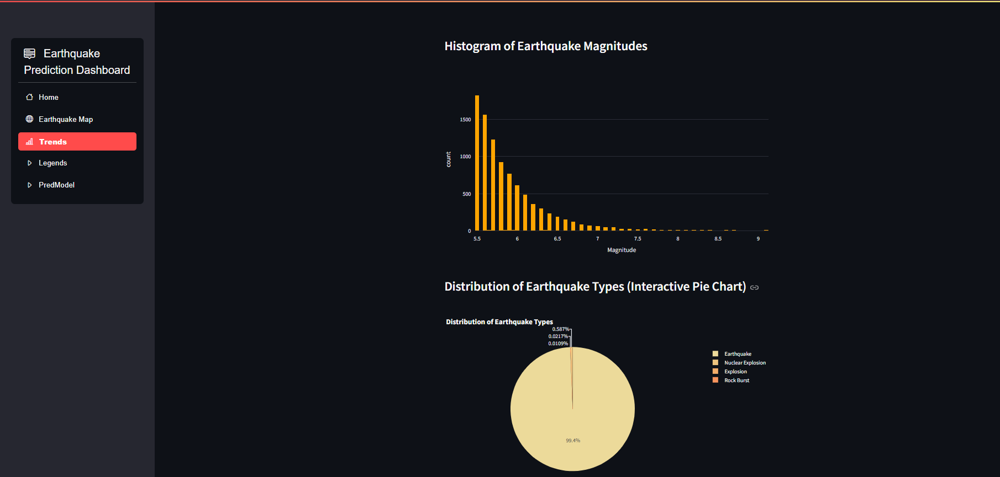

# 🌍 Earthquake Analysis Dashboard

<div align="center">


*A comprehensive earthquake data visualization and prediction platform*


</div>

---

## 📋 Overview

The **Earthquake Analysis Dashboard** is a powerful web application built with Streamlit that provides comprehensive earthquake data analysis, visualization, and magnitude prediction capabilities. The application integrates with MongoDB for data storage and offers interactive maps, trend analysis, and machine learning-based predictions.

## ✨ Features

### 🏠 **Dashboard Home**
- Real-time earthquake statistics and KPIs
- Yearly trend analysis with interactive charts
- Data export functionality (CSV download)
- Comprehensive metrics including total earthquakes, average magnitude, and maximum depth

### 🗺️ **Interactive Earthquake Map**
- Global earthquake visualization on dark-themed maps
- Year-based filtering system
- Clustered markers for better performance
- Location-based popup information with reverse geocoding
- Dynamic magnitude scaling and color coding

### 📈 **Trend Analysis**
- Multi-year earthquake pattern analysis
- Most and least severe earthquake identification
- Interactive year range selection
- Statistical visualizations including:
  - Bar charts for yearly earthquake counts
  - Line plots for magnitude trends
  - Histograms for magnitude distribution
  - Pie charts for earthquake type distribution

### 📊 **Data Legends & Correlations**
- Scatter plots showing relationships between:
  - Latitude vs. Magnitude
  - Longitude vs. Magnitude  
  - Depth vs. Magnitude
- Trend lines and correlation analysis
- Interactive data filtering by year range

### 🤖 **Prediction Model**
- Machine learning-based magnitude prediction
- Input-based earthquake forecasting
- Nearest earthquake finder using geodesic calculations
- Interactive map showing predicted vs. actual earthquake locations

## 🛠️ Tech Stack

- **Frontend**: Streamlit, Plotly, Folium
- **Backend**: Python, MongoDB
- **Machine Learning**: Scikit-learn, Joblib
- **Data Processing**: Pandas, NumPy
- **Geospatial**: GeoPy, Folium
- **Visualization**: Plotly Express, Matplotlib, Seaborn

## 📦 Installation

### Prerequisites
- Python 3.8 or higher
- MongoDB instance (local or cloud)
- Git

### Setup Instructions

1. **Clone the repository**
```bash
git clone https://github.com/yourusername/earthquake-analysis-dashboard.git
cd earthquake-analysis-dashboard
```

2. **Create and activate virtual environment**
```bash
python -m venv earthquake_env
source earthquake_env/bin/activate  # On Windows: earthquake_env\Scripts\activate
```

3. **Install required packages**
```bash
pip install -r requirements.txt
```

4. **Configure MongoDB**
```python
# Update the MongoDB URI in the script
MONGO_URI = "mongodb://localhost:27017/"  # Or your MongoDB Atlas URI
```

5. **Prepare the machine learning model**
```bash
# Ensure your trained model file 'quake_model.pkl' is in the project directory
```

## 🚀 Usage

### Running the Application

```bash
streamlit run app.py
```

The application will be available at `http://localhost:8501`

### Navigation

The dashboard includes five main sections accessible via the sidebar:

1. **Home** - Overview and statistics
2. **Earthquake Map** - Interactive global visualization
3. **Trends** - Historical pattern analysis
4. **Legends** - Data correlation plots
5. **PredModel** - Magnitude prediction tool

### Data Requirements

Your MongoDB collection should contain earthquake data with the following fields:
- `Date`: Earthquake occurrence date
- `Latitude`: Geographic latitude
- `Longitude`: Geographic longitude  
- `Depth`: Earthquake depth in kilometers
- `Magnitude`: Earthquake magnitude
- `Type`: Type of seismic event
- `ID`: Unique identifier

## 📊 Sample Data Structure

```json
{
  "Date": "2023-01-15",
  "Latitude": 35.6762,
  "Longitude": 139.6503,
  "Depth": 10.5,
  "Magnitude": 5.2,
  "Type": "Earthquake",
  "ID": "eq_001"
}
```

## 🔧 Configuration

### Environment Variables
Create a `.env` file in the project root:

```env
MONGO_URI=mongodb://localhost:27017/
DATABASE_NAME=Quake
COLLECTION_NAME=quakes
MODEL_PATH=quake_model.pkl
```

### Customization Options
- **Map Themes**: Modify `tiles` parameter in Folium map creation
- **Color Schemes**: Update color palettes in Plotly charts
- **Data Filters**: Adjust year ranges and filtering criteria
- **Model Parameters**: Replace the ML model with your trained version

## 📈 Screenshots
 ### Earthquake Map
 
 
 ### Trends
  

  ### Predictions
   


## 🤝 Contributing

We welcome contributions! Please follow these steps:

1. Fork the repository
2. Create a feature branch (`git checkout -b feature/AmazingFeature`)
3. Commit your changes (`git commit -m 'Add some AmazingFeature'`)
4. Push to the branch (`git push origin feature/AmazingFeature`)
5. Open a Pull Request

### Development Guidelines
- Follow PEP 8 style guidelines
- Add docstrings to functions
- Include unit tests for new features
- Update documentation as needed

## 📋 Requirements

```txt
streamlit>=1.28.0
pymongo>=4.5.0
pandas>=1.5.0
plotly>=5.15.0
folium>=0.15.0
streamlit-option-menu>=0.3.6
streamlit-folium>=0.15.0
numpy>=1.24.0
matplotlib>=3.7.0
seaborn>=0.12.0
geopy>=2.3.0
joblib>=1.3.0
scikit-learn>=1.3.0
```

## 🐛 Known Issues

- Large datasets may cause performance issues with map clustering
- Geocoding API has rate limits for location name resolution
- MongoDB connection timeout may occur with slow networks


## 🙏 Acknowledgments

- Earthquake data sources and providers
- Streamlit community for excellent documentation
- MongoDB for robust data storage solutions
- Plotly for interactive visualization capabilities


</div>
